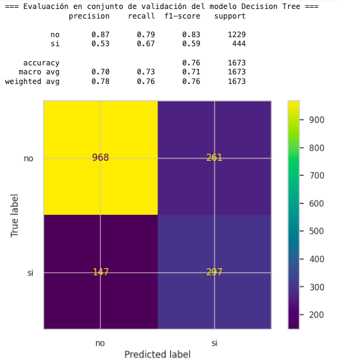
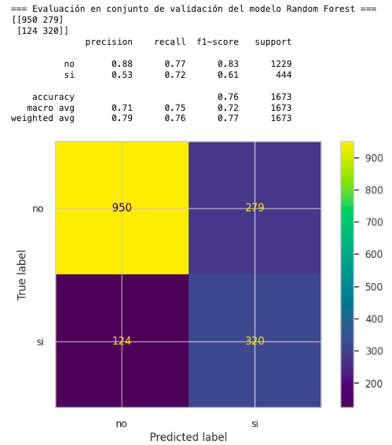
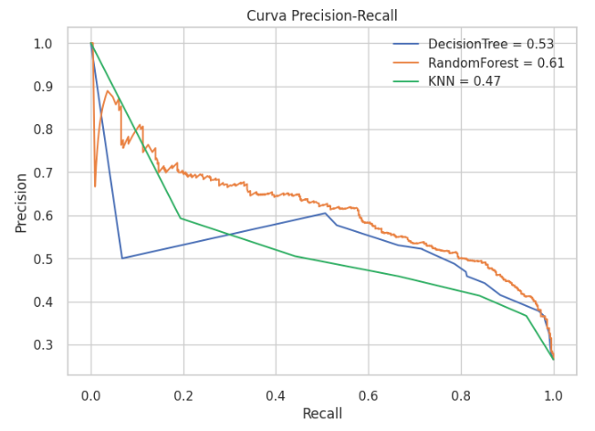
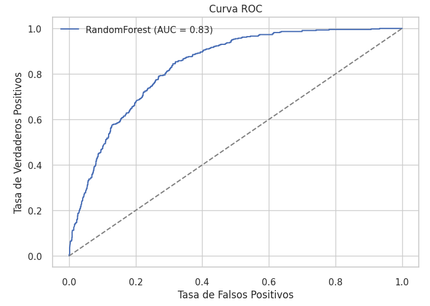
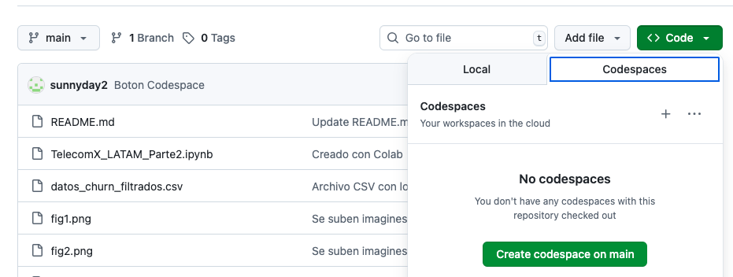

# Challenge ONE
# Practicando Machine Learning - Data Science – Telecom X (parte 2)

## 📚 Análisis de Evasión de Clientes

Este proyecto analiza datos de una empresa de telecomunicaciones para identificar los factores que influyen en la evasión de clientes. Se utilizaron herramientas de ciencia de datos para visualizar, cuantificar y predecir comportamientos de abandono, con el objetivo de proponer estrategias de retención.

---

## 🧠 Objetivo del Proyecto

- Investigar los factores que inciden en la decisión de un cliente de cancelar el servicio.
- Detectar patrones de evasión según edad, método de pago, permanencia y monto pagado.
- Entregar visualizaciones claras y conclusiones accionables para el área de retención.

---

## 📊 Descripción de los datos

Eso es la segunda parte del proyecto. La BBDD original y su diccionario de datos se puede encontrar [acá](https://github.com/sunnyday2/challenge2_data_science_TelecomX)

---

## 📑 Tabla de Contenido de Notebook

1. Cargar el archivo CSV que contiene los datos tratados anteriormente 
2. Eliminar columnas irrelevantes 
   - Revisar los valores de columnas codependientes 
   - Volver a los valores categóricos  
3. Transformar las variables categóricas a formato numérico 
4. Verificar la proporción de cancelación (Churn)  
5. Dividiendo los datos entre entrenamiento, validación y prueba  
6. Análisis dirigido 
   - Tiempo de contrato vs Cancelación 
   - Distribución de Gasto total vs Cancelación 
   - Tiempo de contrato vs Gasto total 
7. Tipos de modelos y su selección para el proyecto
   - Diferencias entre modelos de Regresión y Clasificación
   - Selección del modelo
8. Ajustando modelos
   - Modelo de referencia 
   - Árboles de decisión
     - Decision Tree 
     - Probando el modelo Decision Tree 
     - Random Forest 
     - Probando el modelo Random Forest 
   - Modelos basados en distancia
     - KNN (k-Nearest Neighbors)
     - Probando el modelo KNN
9. Informes de métricas
    - Curva ROC
    - Curva Precision-Recall
    - Comparación de curvas ROC entre modelos 
11. Feature importances (atributos más importantes del modelo)
12. Escogiendo y serializando el mejor modelo
    - Evaluamos la tasa de acierto de los modelos
    - Serializando los modelos
13. Conclusión
    - Modelos de Clasificación evaluados
    - Comparación de Modelos
    - Análisis de curvas
      - Curva Precision-Recall
      - Curva ROC
    - Principales factores que influyen en la cancelación
    - Estrategias de retención 

---

## 📸 Algunas Visualizaciones de Notebook

### Decision Tree

#### Validación del modelo


### Random Forest

#### Validación del modelo


### KNN (k-Nearest Neighbors)

#### Validación del modelo


#### Curva Precision-Recall


#### Curva ROC

---

## 📝 Requerimientos

### Este proyecto requiere Python 3.8+ y las siguientes bibliotecas:

- pandas
- numpy
- matplotlib
- seaborn
- yellowbrick
- plotly
- scikit-learn
- imblearn
- joblib
- notebook (para ejecutar archivos .ipynb localmente) o un entorno virtual

```bash
#### Para revisar las versiones instaladas
import pandas as pd
import numpy as np
import matplotlib
import seaborn as sns
import yellowbrick
import plotly
import sklearn
import imblearn
import joblib

print("pandas:", pd.__version__)
print("numpy:", np.__version__)
print("matplotlib:", matplotlib.__version__)
print("seaborn:", sns.__version__)
print("yellowbrick:", yellowbrick.__version__)
print("plotly:", plotly.__version__)
print("scikit-learn:", sklearn.__version__)
print("imblearn:", imblearn.__version__)
print("joblib:", joblib.__version__)
```
  
## ¿Como puedes ejecutar un notebook?

- Ejecutarlo localmente en Visual Studio Code
- Cargar el archivo .ipynb a tu Google Disk y ejecutar el notebook en [Google Colab](https://colab.research.google.com)
- Ejecutar en el entorno virtual de GitHub. En tu repositorio, haz clic en el botón verde Code → pestaña Codespaces → selecciona Ceate codespace on main (o la rama que quieras). 

## ⚙️ Instalación y dependencias en el entorno virtual

```bash
pip install pandas numpy matplotlib seaborn plotly

# 🧰 ¿Qué necesitas para ejecutar .ipynb localmente?
# ✅ 1. Tener Python instalado
# - Puedes descargarlo desde python.org.
# - Asegúrate de marcar “Add Python to PATH” durante la instalación.

### ✅ 2. Instalar Jupyter Notebook o JupyterLab
# - Lo más cómodo es hacerlo dentro de un entorno virtual:

# Crear entorno virtual (solo la primera vez)
python -m venv venv

# Activar el entorno
# En Windows:
venv\Scripts\activate

# En macOS/Linux:
source venv/bin/activate

# Instalar Jupyter y librerías necesarias
pip install notebook jupyterlab pandas numpy matplotlib seaborn plotly yellowbrick sklearn imblearn joblib

# ✅ 3. Ejecutar Jupyter Notebook
jupyter notebook
```
