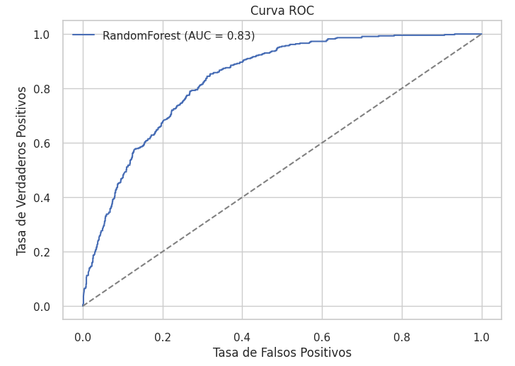

# Informe de Modelos de Clasificación - Cancelación de Clientes

Este informe documenta los resultados obtenidos en el análisis de cancelación de clientes para la empresa **TelecomX LATAM**, utilizando distintos modelos de clasificación. El objetivo es identificar los principales factores que influyen en la **cancelación (churn)** y proponer estrategias de retención basadas en los hallazgos.

---

## Modelos de Clasificación Evaluados

Se probaron distintos algoritmos para comparar su rendimiento en la predicción de cancelación de clientes:

- **Dummy Classifier**: modelo base para tener un punto de referencia (baseline).
- **Árbol de Decisión**: fácil de interpretar, permite identificar reglas claras de decisión.
- **Random Forest**: modelo de ensamble, mejora la estabilidad y el rendimiento respecto a un único árbol.
- **KNN (K-Nearest Neighbors)**: requiere normalización de datos, evalúa similitudes entre clientes.

La métrica principal utilizada fue **recall**, ya que el interés está en **detectar la mayor cantidad de clientes que cancelan** (minimizando falsos negativos).

---

## Comparación de Modelos

Los resultados obtenidos muestran que:

- **Random Forest** logró el mejor equilibrio entre precisión y recall. Su capacidad de ensamble le permite capturar relaciones no lineales y reducir el sobreajuste.
- El **Árbol de Decisión** fue útil para interpretar factores de riesgo, pero tuvo menor estabilidad y recall que Random Forest.
- El **KNN**, aunque normalizado, no alcanzó el rendimiento esperado, probablemente por la dimensionalidad y dispersión de los datos.
- El **Dummy Classifier** confirma que los demás modelos superan el rendimiento de la simple predicción aleatoria.

En resumen, el **Random Forest** es el mejor modelo para este caso, alcanzando un **AUC de 0.83** y un **Average Precision (AP) de 0.61**, lo que indica un buen desempeño para la detección de clientes en riesgo.

---

## Análisis de Curvas

### Figura 1: Curva Precision-Recall (fig1.png)

- La **precisión promedio es de 0.61**, lo que significa que, al clasificar clientes como en riesgo de cancelar, el 61% efectivamente cancela.
- El comportamiento decreciente de la curva refleja que, a medida que se busca capturar más clientes (mayor recall), disminuye la precisión.
- Esto indica un **trade-off**: se debe balancear entre captar la mayoría de clientes que cancelan (recall) y evitar falsos positivos.

### Figura 2: Curva ROC (fig2.png)

- El **AUC de 0.83** confirma que el modelo distingue bien entre clientes que cancelan y los que no.
- La curva está muy por encima de la diagonal aleatoria, lo que valida el buen rendimiento del Random Forest.

---

## Principales Factores que Influyen en la Cancelación

Según las variables seleccionadas y los resultados del modelo, los factores más relevantes fueron:

- **Duración del contrato**: los clientes con contratos de corto plazo presentan mayor probabilidad de cancelar.
- **Uso de servicios adicionales**: quienes no contratan servicios extra (internet, TV, paquetes premium) muestran mayor tasa de abandono.
- **Nivel de facturación mensual**: cuentas con cobros elevados tienen más riesgo de cancelación.
- **Interacciones con servicio al cliente**: un alto número de reclamos o llamadas se asocia con mayor churn.
- **Forma de pago**: clientes que usan métodos menos automáticos (ej. pago manual) tienden a cancelar más.

---

## Estrategias de Retención Propuestas

Con base en los resultados, se recomiendan las siguientes acciones:

1. **Incentivar contratos a largo plazo**: ofrecer descuentos o beneficios por permanencia mínima.
2. **Promocionar servicios adicionales**: paquetes personalizados que aumenten la satisfacción y dependencia del cliente.
3. **Revisar política de precios**: segmentar promociones para clientes de alta facturación y riesgo.
4. **Mejorar la atención al cliente**: programas de fidelización y respuestas rápidas a reclamos.
5. **Facilitar pagos automáticos**: incentivar a los clientes a migrar a métodos de débito automático o tarjetas.

---

## Conclusión

El análisis muestra que **Random Forest** es el mejor modelo para predecir la cancelación de clientes, proporcionando un balance adecuado entre recall y precisión.  
Los factores más relevantes están relacionados con la **duración del contrato, facturación, servicios adicionales y experiencia del cliente**.  
Las estrategias propuestas apuntan a **reducir el churn y aumentar la fidelización**, mejorando la sostenibilidad del negocio.

---
